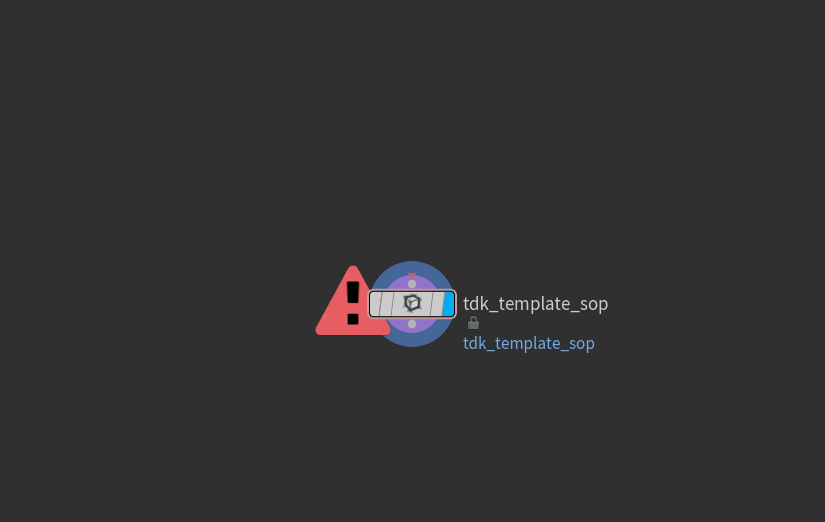
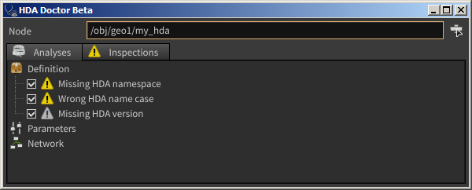
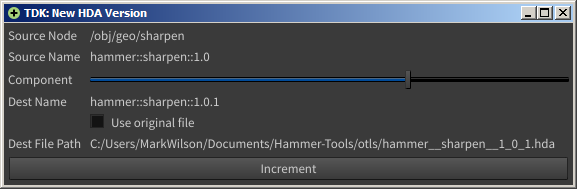
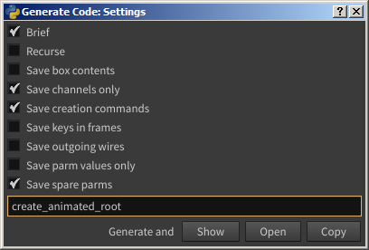
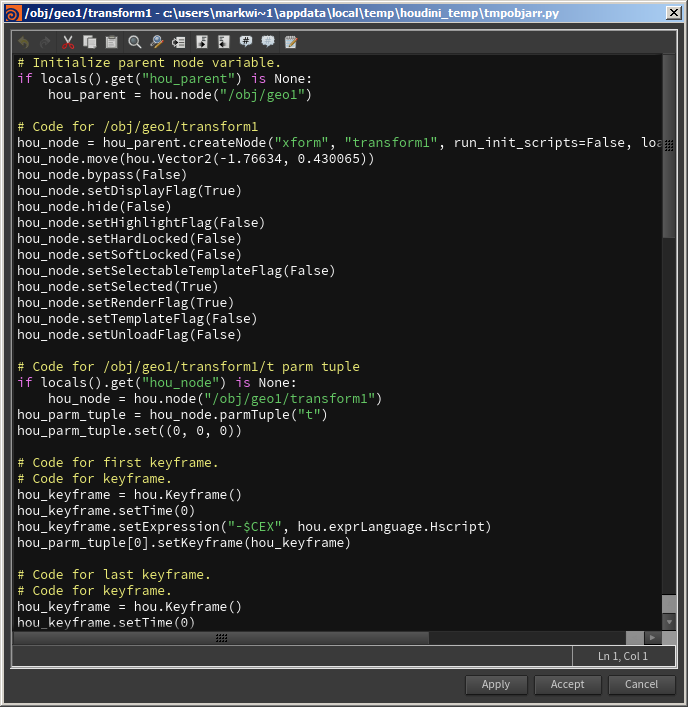
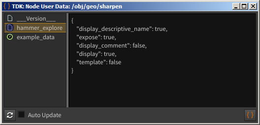
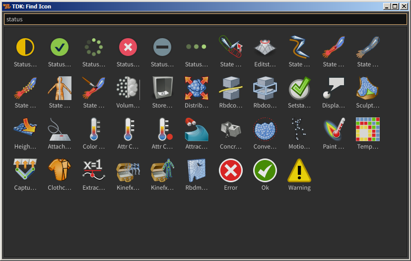

## Access
- [Shelf named **Tool Development Kit**](#shelf)
- [Node context menu named **TDK Actions**](#node-context-menu)

## Tools
- [Make HDA](#make-hda)
- [Templates](#templates)
- [Operator Manager](#operator-manager)
- [HDA Doctor](#hda-doctor-beta)
- [New HDA Version](#new-hda-version)
- [Generate Code](#generate-code)
- [Show Node User Data](#show-node-user-data)
- [Network Statistics](#network-statistics)
- [Find Icon](#find-icon)
- [Find Node Shape](#find-node-shape)

#### Shelf

#### Node context menu

#### Make HDA

#### Templates
Template HDAs that allows you to quickly create new HDAs based on them.

#### Operator Manager

#### HDA Doctor *Beta*
Tool that allows you to test your HDA with a set of inspections that check for compliance with high standards of HDA development.

#### New HDA Version
Increments an HDA version of the selected node. You can select the version type (major, minor, build, etc.).

#### Generate Code
Applies `.asCode()` to selected nodes. Then copies the resulting code to the clipboard or shows in code editor.

#### Show Node User Data
Shows user data and cached user data of the selected node.

#### Network Statistics

#### Find Icon
Allows you to quickly find an icon for your tool.

#### Find Node Shape

